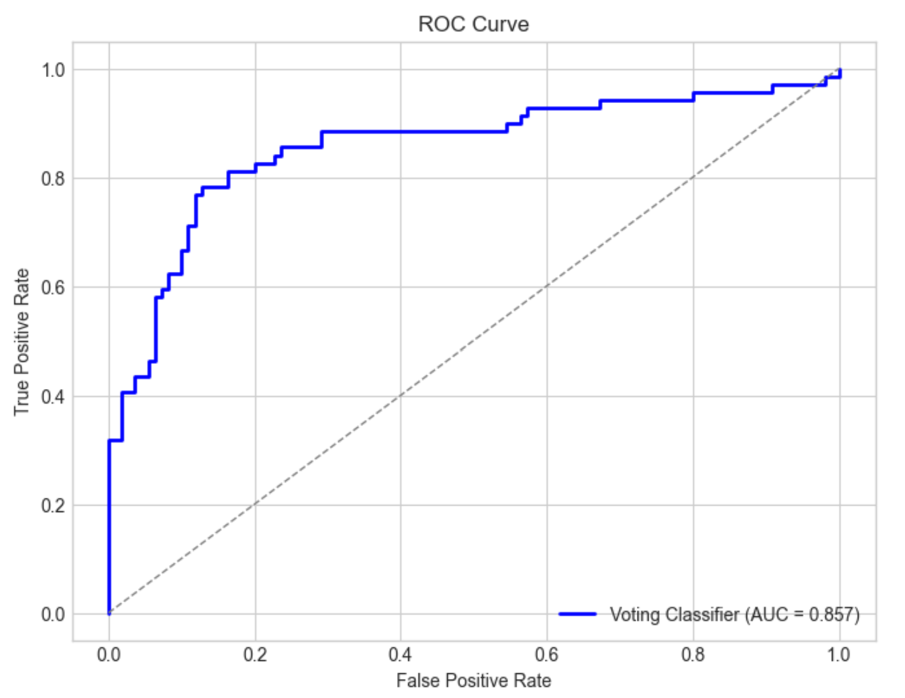
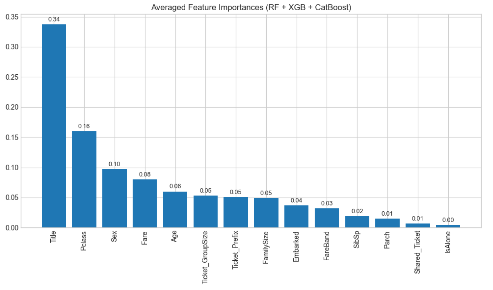

## 🛳 Titanic Survival Prediction (ML Classification Project)

### 📌 Overview
This project aims to predict passenger survival on the Titanic using machine learning classification techniques. It covers the complete pipeline from data preprocessing and feature engineering to model training, hyperparameter tuning, and evaluation — ending with ensemble modeling for optimal performance.

---

### 📁 Dataset
- Source: [Kaggle Titanic Dataset](https://www.kaggle.com/competitions/titanic)
- Columns used: `Pclass`, `Sex`, `Age`, `Fare`, `Embarked`, `Title`, `FamilySize`, `Ticket Prefix`, `FareBand`, etc.
- Target: `Survived` (0 = No, 1 = Yes)

---

### ⚙️ Project Workflow
- 🔍 Exploratory Data Analysis (EDA)
- ⚙️ Data Preprocessing
  - Handling missing values
  - Creating features like `Title`, `IsAlone`, `FamilySize`
  - Target Encoding for categorical features
- 📈 Model Training:
  - Decision Tree, Random Forest, XGBoost, LightGBM, CatBoost
- 🔧 Hyperparameter Tuning via `RandomizedSearchCV`
- 🧠 Ensemble Voting Classifier (Soft Voting)
- 📊 Evaluation: Accuracy, Precision, Recall, F1, ROC-AUC
- 📉 Feature Importance (blended from top 3 models)

---

### ✅ Results Summary
| Model                   | Accuracy | AUC Score |
|------------------------|----------|-----------|
| XGBoost                | 82.1%    | 0.857     |
| CatBoost               | 81.6%    | —         |
| Random Forest          | 81.0%    | —         |
| **Voting Ensemble**    | **82.1%**| **0.857** |

- **Most important features**: `Title`, `Pclass`, `Sex`
- **Top model**: VotingClassifier (XGB + CatBoost + RF)

---

### 📊 Visualizations
- ROC Curve  
- Blended Feature Importances Bar Chart  
- Survival distributions by features (from EDA)

---

### 🧪 How to Run

1. Clone the repo:
   ```bash
   git clone https://github.com/your-username/titanic-survival-prediction.git
   cd titanic-survival-prediction
   ```

2. Install dependencies:
    ```bash
    pip install -r requirements.txt
   ```

3. Open and run the notebook:
   ```bash
   jupyter notebook Titanic_Analysis.ipynb
   ```


### 💡 Future Improvements

- 📌 **Use SHAP values for deeper interpretability**  
  SHAP (SHapley Additive exPlanations) can help visualize how each feature contributes to individual predictions, especially useful for black-box models like XGBoost and CatBoost.

- 🧠 **Try neural network models (e.g., MLPClassifier)**  
  Adding a basic multi-layer perceptron could show how deep learning performs on structured/tabular data compared to tree-based methods.

- ⚙️ **Automate full pipeline using `FunctionTransformer` or `ColumnTransformer`**  
  This ensures modular, scalable code for real-world deployment, especially when combining different transformations for numeric and categorical features.


### 📸 Visualizations

#### 🔍 ROC Curve
Shows the model's ability to distinguish between survival and non-survival cases.


#### 📊 Feature Importances
Highlights which features influenced predictions the most.



### 🧾 Key Takeaways

- Target encoding and feature engineering (Title, IsAlone, etc.) significantly improved performance.
- Ensemble models (VotingClassifier) outperformed individual models by blending their strengths.
- The most impactful features for predicting survival were: `Title`, `Pclass`, and `Sex`.
- Final accuracy achieved was **82.1%**, with an ROC-AUC of **0.857**, indicating strong classification performance.